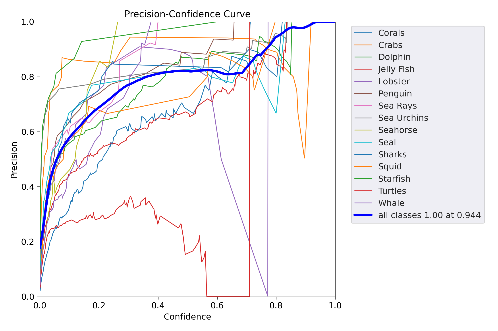
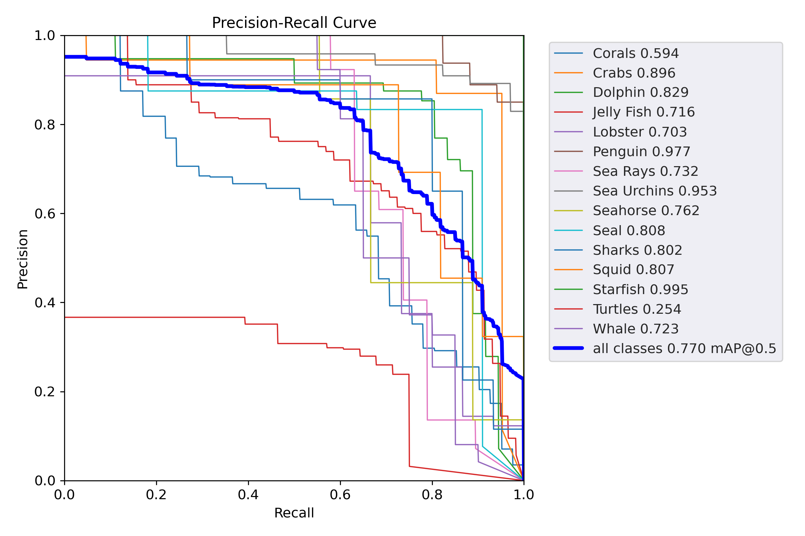
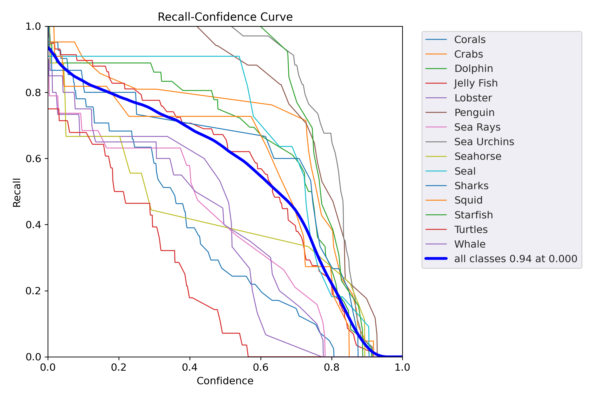
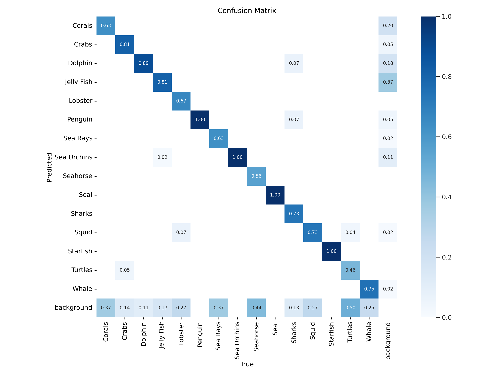

# Yolov5目标检测模型

## YOLOv5在海洋生物检测领域的应用
**相关工作:**  
1. 数据准备：一组有标记的海洋数据用于训练和测试(共15种较为常见的海海洋生物)
2. 模型准备：YOLOv5l
3. 计算工具：NVIDIA RTX3090、

## 环境配置
终端运行
```shell
pip install -r requirements.txt
```

## 从零开始训练海洋生物检测模型
```shell
python train.py --img 640 --batch 32 --epochs 100 --data data/data.yaml --cfg models/yolov5l.yaml --name yolov5_pretrain --cache
```

## 预训练结果
> Precision-Confidence


> Precision-Recall


> Recall-Confidence


> 混淆矩阵


## 参考
YOLOv5[https://github.com/ultralytics/yolov5]